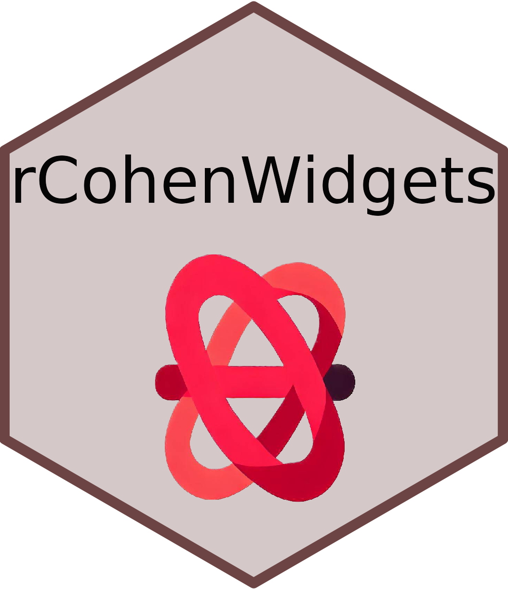

<!-- README.md is generated from README.Rmd. Please edit that file -->

```{r, include = FALSE}
knitr::opts_chunk$set(
  collapse = TRUE,
  comment = "#>",
  fig.path = "man/figures/README-",
  out.width = "100%"
)
```

# rCohenWidgets 

<!-- badges: start -->
[](https://lifecycle.r-lib.org/articles/stages.html#experimental)
<!-- badges: end -->

El propósito principal de rCohenWidgets es proporcionar la capacidad de integrar componentes y bibliotecas de React en una aplicación Shiny. Aunque nuestra atención se centra principalmente en React, no limitamos su alcance exclusivamente a este framework. Estamos abiertos a incorporar funciones elaboradas con Javascript y otros frameworks. Nuestro objetivo es ampliar continuamente las funcionalidades de esta librería para potenciar el desarrollo de aplicaciones Shiny más versátiles y ricas en características.

## Instalación

Se puede instalar la versión development de rCohenWidgets desde [GitHub](https://github.com/) de la siguiente manera:

``` r
# install.packages("devtools")
devtools::install_github("datoscohen/rCohenWidgets")
```
